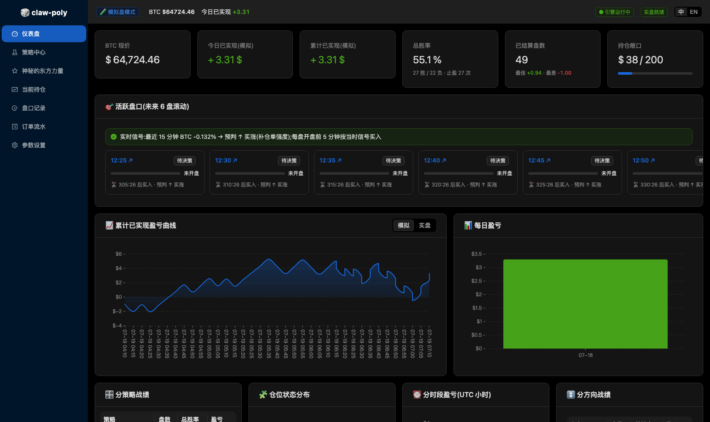
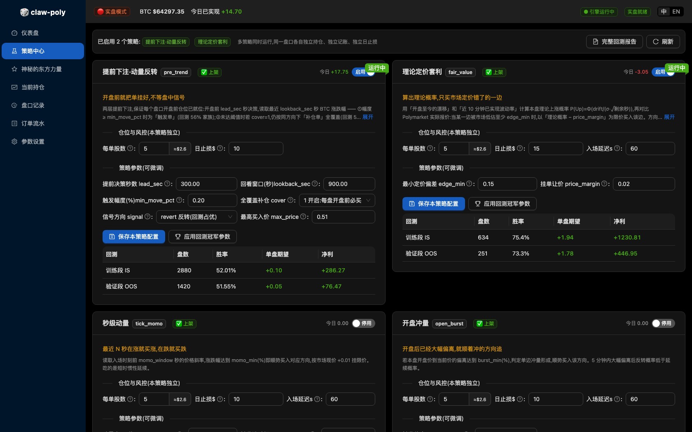
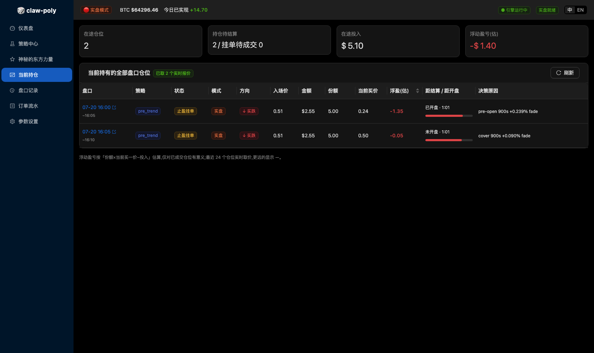

# 🎲 claw-poly

[](LICENSE)

**Automated multi-strategy trading bot for Polymarket's BTC 5-minute Up/Down markets** — pre-open betting, disciplined backtesting, a React admin console, and one fortune-telling strategy for fun.

**Polymarket BTC 5 分钟涨跌盘多策略自动交易机器人** —— 开盘前预下注、严格回测纪律、React 管理台,外加一个纯娱乐的命理策略。



---

## English

### What it does

claw-poly trades Polymarket's `btc-updown-5m` series — a new "will BTC close up or down?" market every 5 minutes, all day long. Markets list up to **8 hours** before they open, so the bot discovers them early, decides direction, places limit orders **before the round starts**, manages take-profits, books settlements, and rolls forward hands-free.

### Features

- **6 built-in strategies running concurrently** — each with its own share size, daily stop-loss, entry timing and tunable parameters; every strategy keeps an independent position per round:
  - `pre_trend` — buys **before the round opens** (mean-reversion signal; full-coverage or trigger-only)
  - `fair_value` — theoretical P(Up) from drift + realized volatility, buys only market mispricings
  - `tick_momo` / `open_burst` / `prev_reverse` — in-round momentum & reversal plays
  - `mystic_east` 🔮 — **entertainment only**: name + lunar birthday + the day's Chinese almanac seed a deterministic 1–100-round "destiny chart". Zero science, disclaimers built in.
- **Backtest suite** — 7/15-day BTC 1-second data, train/validate split (IS/OOS), parameter-plateau checks, spread sensitivity; reports readable inside the app
- **Paper / Live modes** — paper by default. All secrets (Clawby key, wallet private key, relayer key) are entered in the admin, verified, and written only to your local `.env` — never echoed or uploaded
- **Built-in wallet** — guided two-step deposit and withdrawal between your Polymarket website wallet and the bot's trading wallet (gasless, addresses derived from your key — nothing to type, nothing to mistype)
- **Auto-redeem** — resolved winnings are swept into collateral on-chain automatically (EOA accounts; settings toggle)
- **React admin console** — dashboard, strategy center with inline parameter editing, open positions with live quotes, full round/order history with CSV export, bilingual UI (中/EN)
- **Resilience** — price buffer backfills on restart, REST fallback when the WebSocket drops, log rotation, per-strategy + global loss halts



### ⚠️ Requires a Clawby account (enforced)

Market data — round discovery, orderbooks, price history — flows through the **[Clawby](https://openclawby.com)** relay. **Register at [openclawby.com](https://openclawby.com) and get an API key first.** The free tier is enough for paper trading. Order signing happens locally and never touches Clawby.

The key is **mandatory and enforced at runtime**: without it the trading engine stays parked (no market calls, no orders) and every page shows a blocking banner. The web server still starts so you can enter the key — paste it in **Settings → Clawby data relay**, it is verified against the relay live, saved to your local `.env`, and the engine resumes within seconds. No restart, no manual file editing.

### Position sizing is in shares, not dollars

Polymarket enforces a **5-share minimum per order**. Cost = `shares × fill price`, e.g. 5 shares × $0.51 ≈ **$2.55**; a winning share settles at $1.00. The admin shows the dollar estimate next to the share input.

### Install

Prerequisites: **Python 3.10+** (main app), **Python 3.11+** (wallet operations, see below), **Node.js 18+**.

```bash
git clone <this repo> && cd claw-poly

# 1. backend
python3 -m venv .venv
./.venv/bin/pip install -r requirements.txt

# 2. wallet ops SDK — needs Python >= 3.11, kept in a separate venv on purpose
python3.12 -m venv .venv-sdk
./.venv-sdk/bin/pip install --pre polymarket-client

# 3. frontend (build once; rebuild only after UI changes)
cd frontend && npm install && npm run build && cd ..

# 4. config (optional here — you can also paste the key in the admin UI later)
cp .env.example .env        # edit: CLAWBY_API_KEY=pk_...

# 5. run
set -a; source .env; set +a
./.venv/bin/uvicorn app.main:app --port 8643
# open http://127.0.0.1:8643/admin  (no login; binds to localhost only)
```

Backtests (optional, but read the reports before trading):

```bash
./.venv/bin/python -m backtest.data      # 7-day BTC 1s + real-round odds samples
./.venv/bin/python -m backtest.report    # strategy grids     -> backtest/REPORT.md
./.venv/bin/python -m backtest.data15    # 15-day dataset
./.venv/bin/python -m backtest.opt15     # pre_trend tuning   -> backtest/OPT15.md
./.venv/bin/python -m pytest tests/ -q   # unit tests
```

### Going live (real money — read carefully)

Since 2026 Polymarket requires a **deposit wallet** to place orders: your EOA signs, and a contract wallet derived from that key holds funds and trades. A wallet-login account on polymarket.com is **not** automatically usable by the API — if the CLOB answers *"maker address not allowed, please use the deposit wallet flow"*, that is exactly this gap.

Every address below is derived from the same private key and re-derivable at any time — **only the key needs backing up.**

1. **Settings → Wallet private key** — paste your key. Verified locally (address derivation), written to your local `.env`, effective without restart.
2. **Settings → Trading account → one-click set up** — deploys the deposit wallet (gasless), enables trading approvals, and writes the order identity (funder + signature type 3) for you. Needs a **Polymarket relayer API key** (paste it right there on the same card — the signer address is derived from your private key automatically) and the `.venv-sdk` from install step 2. The card shows exactly what is missing, and the whole action is idempotent — safe to re-run.
3. **Fund it** — Settings → Deposit: log in to polymarket.com, deposit as usual (card / exchange / bridge), then click **move to trading wallet**. Advanced users can send USDC straight to the trading address (**Polygon network only**).
4. Flip the **LIVE** switch. Start at the 5-share minimum and compare real fills with paper before sizing up.

> **Two accounts, one key.** The website may keep showing your legacy proxy wallet with a $0 balance while funds live in the deposit wallet — that is expected during Polymarket's migration. Do not use the website's Deposit button while they are split: money lands in the legacy wallet, and you have to move it in from Settings → Deposit before the bot can use it.



### Project structure

```
app/
├── main.py       FastAPI app · REST API · static admin hosting
├── engine.py     15s multi-strategy engine (position state machine, risk gates)
├── strategy.py   6 strategies + bilingual metadata
├── executor.py   paper simulation / live orders (py-clob-client-v2)
├── addresses.py  CREATE2 wallet derivation + on-chain collateral balance
├── redeem.py     on-chain auto-redeem of resolved winnings (CTF)
├── mystic.py     Chinese almanac math + destiny-chart generator (for fun)
├── markets.py    round discovery & settlement    ├── btc.py     BTC 1s price feed
├── clawby.py     Clawby relay client (throttled) ├── db.py      SQLite storage
└── admin.html    legacy single-page admin (/admin-lite)
scripts/
└── wallet_ops.py gasless deposit/withdraw runner (executed with .venv-sdk)
frontend/         React 18 + Ant Design 5 + @ant-design/plots admin (Vite)
└── src/pages/    Dashboard · Strategies · Mystic · Positions · Rounds · Orders · Settings
backtest/         data fetchers · simulators · optimizers · reports
tests/            unit tests
```

### License

MIT — see [LICENSE](LICENSE). Do whatever you like; keep the copyright notice.

### Disclaimer

5-minute binary markets are fast and close to efficiently priced. Backtests here use optimistic fill models; live paper results are the honest referee. **This software is not financial advice; trade at your own risk.**

---

## 中文

### 这是什么

claw-poly 自动交易 Polymarket 的 `btc-updown-5m` 系列 —— 每 5 分钟一个"BTC 涨还是跌"盘口,全天滚动。盘口最早提前 **8 小时**挂牌,机器人提前发现、判方向、**在开盘前挂好限价单**、管理止盈、结算记账、滚动续盘,全程无人值守。

### 功能

- **6 个内置策略,支持同时运行** —— 每个策略独立设置每单股数、日止损、入场时机与参数,同一盘口各自独立持仓记账:
  - `pre_trend` 提前下注 —— **开盘前就买入**(均值回归信号,可全覆盖或只做强触发)
  - `fair_value` 理论定价套利 —— 漂移+波动率算理论概率,只买市场定错价的一边
  - `tick_momo` 秒级动量 / `open_burst` 开盘冲量 / `prev_reverse` 前盘反转 —— 盘中策略
  - `mystic_east` 神秘的东方力量 🔮 —— **纯娱乐**:姓名+农历生辰+当日黄历(内置万年历推演干支/建除十二神)生成确定性命盘,一次推演 1~100 盘,买完自动收工。零科学性,免责声明写死在页面上。
- **回测体系** —— 7/15 天 BTC 秒级数据,训练/验证分离(IS/OOS),参数邻域平原检验、点差敏感性;报告管理台直接看
- **模拟 / 实盘双模式** —— 默认模拟;全部密钥(Clawby Key、钱包私钥、Relayer 密钥)均在管理台填写、校验后只写入本机 `.env`,永不回显/上传
- **内置钱包** —— 两步式充值与提现(网页端账户 ↔ 交易账户),免 gas,**地址由私钥推导、界面只读**,不用手输也就不会输错
- **自动赎回** —— 实盘赢面份额链上自动赎回(EOA 账户;设置页开关)
- **React 管理台** —— 仪表盘、策略中心(卡片内直接调参)、当前持仓(实时报价+浮盈)、盘口/订单全量历史+CSV 导出、中英双语
- **可靠性** —— 重启自动回填价格缓冲、WebSocket 断线 REST 兜底、日志自动轮转、策略级+全局双层熔断

### ⚠️ 必须注册 Clawby(强制)

全部市场数据 —— 盘口发现、订单簿、价格历史 —— 都经由 **[Clawby](https://openclawby.com)** 数据通道获取。**请先到 [openclawby.com](https://openclawby.com) 注册获取 API Key**,免费档足够跑模拟盘。下单签名在本地完成,私钥不经过 Clawby。

这个 Key 是**强制的,运行期硬性拦截**:没有它,交易引擎不会启动任何行情请求、不会下任何单,每个页面顶部显示醒目阻断横幅。Web 服务本身照常启动(否则你没法进后台填 Key)—— 在**参数设置 → 数据通道 Clawby** 粘贴即可,系统会向 Clawby 实时校验、写入本机 `.env`,引擎几秒内自动恢复运行,**无需重启、无需手改文件**。

### 仓位按「股数」配置,不是金额

Polymarket 强制**每单最少 5 股**。花费 = `股数 × 成交价`,例:5 股 × 0.51 ≈ **$2.55**;买对了每股结算 $1.00。管理台在股数输入框旁实时显示折算金额。

### 安装

前置:**Python 3.10+**(主程序)、**Python 3.11+**(钱包功能,见下)、**Node.js 18+**。

```bash
git clone <本仓库> && cd claw-poly

# 1. 后端
python3 -m venv .venv
./.venv/bin/pip install -r requirements.txt

# 2. 钱包 SDK —— 官方统一 SDK 要求 Python >= 3.11,故独立一个 venv
python3.12 -m venv .venv-sdk
./.venv-sdk/bin/pip install --pre polymarket-client

# 3. 前端(构建一次即可;改 UI 后重跑 build)
cd frontend && npm install && npm run build && cd ..

# 4. 配置(也可先跳过,启动后在管理台里填 Key)
cp .env.example .env        # 编辑:CLAWBY_API_KEY=pk_...

# 5. 启动
set -a; source .env; set +a
./.venv/bin/uvicorn app.main:app --port 8643
# 打开 http://127.0.0.1:8643/admin(免登录,仅监听本机)
```

回测(可选,但建议交易前先读报告):

```bash
./.venv/bin/python -m backtest.data      # 7 天 BTC 秒级数据 + 真实盘口赔率样本
./.venv/bin/python -m backtest.report    # 策略网格   -> backtest/REPORT.md
./.venv/bin/python -m backtest.data15    # 15 天数据集
./.venv/bin/python -m backtest.opt15     # pre_trend 调参 -> backtest/OPT15.md
./.venv/bin/python -m pytest tests/ -q   # 单元测试
```

### 切实盘(真金白银,务必细读)

Polymarket 自 2026 年起要求用**充值钱包**下单:你的 EOA 负责签名,由这把私钥推导出的合约钱包持有资金并交易。**在 polymarket.com 用钱包登录过 ≠ API 能直接交易** —— 若下单报 *"maker address not allowed, please use the deposit wallet flow"*,差的就是这一步。

下面所有地址都出自同一把私钥、随时可重新推导 —— **只需要备份私钥**。

1. **参数设置 → 钱包私钥** —— 粘贴私钥,本地校验推导地址后写入本机 `.env`,免重启生效。
2. **参数设置 → 交易账户 → 一键开通** —— 自动免 gas 部署充值钱包、开通交易授权、写入下单身份(资金地址 + 签名类型 3)。需要 **Polymarket 免 gas 通道密钥**(就在同一张卡片里直接粘贴即可,签名地址自动从私钥推导)以及安装第 2 步的 `.venv-sdk`;卡片会明确列出缺什么。该操作幂等,重复点击安全。
3. **入金** —— 参数设置 → 充值:登录 polymarket.com 按习惯方式充值(银行卡/交易所/跨链),回管理台点**转入交易账户**;进阶用户可直接向交易账户地址转 USDC(**必须走 Polygon 网络**)。
4. 打开**实盘开关**。建议先用 5 股最小单量试跑,对比实盘成交与模拟盘的差距后再加仓。

> **两个账户,同一把钥匙。** 迁移期内,网页端可能仍显示旧代理钱包且余额为 $0,而资金实际在充值钱包里 —— 这是正常现象。账户分家期间**不要用网页的充值按钮**:钱会进旧账户,必须再用「参数设置 → 充值 → 转入交易账户」搬进来机器人才能用。

### 项目结构

```
app/
├── main.py       FastAPI 应用 · REST API · 管理台静态托管
├── engine.py     15 秒多策略引擎(仓位状态机、双层风控)
├── strategy.py   6 个策略 + 双语元数据
├── executor.py   模拟撮合 / 实盘下单(py-clob-client-v2)
├── addresses.py  CREATE2 钱包地址推导 + 链上余额读取
├── redeem.py     链上自动赎回(CTF redeemPositions)
├── mystic.py     内置万年历推演 + 命盘生成(娱乐)
├── markets.py    盘口发现与结算                ├── btc.py     BTC 秒级行情
├── clawby.py     Clawby 数据通道客户端(限速)  ├── db.py      SQLite 存储
└── admin.html    旧版单页管理台(/admin-lite)
scripts/
└── wallet_ops.py 免 gas 充值/提现执行器(用 .venv-sdk 运行)
frontend/         React 18 + Ant Design 5 + @ant-design/plots(Vite 构建)
└── src/pages/    仪表盘 · 策略中心 · 神秘的东方力量 · 当前持仓 · 盘口记录 · 订单流水 · 参数设置
backtest/         数据拉取 · 模拟器 · 调参器 · 报告
tests/            单元测试
```

### 开源协议

MIT —— 见 [LICENSE](LICENSE)。可自由使用/修改/商用,保留版权声明即可。

### 风险提示

5 分钟二元盘波动极快且接近有效定价;本仓库回测采用偏乐观的成交假设,模拟盘实测才是裁判。**本软件不构成任何投资建议,盈亏自负。**
